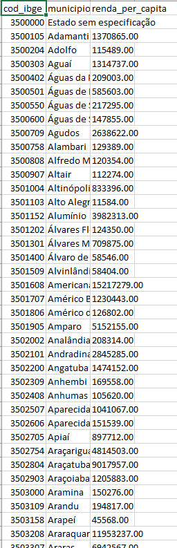
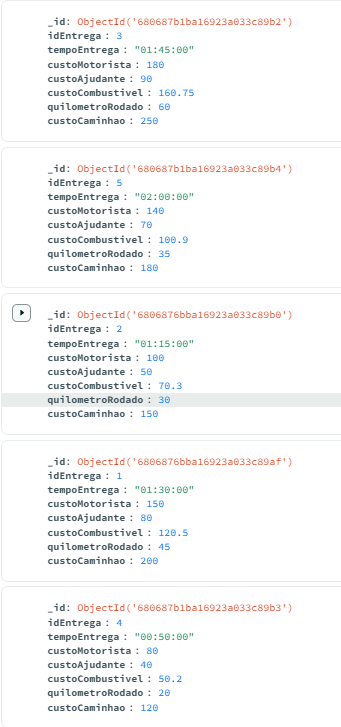
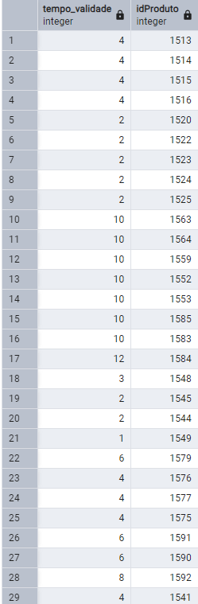

# ETL ⛏ > 🧪 > 🚚

Na pasta ETL está os scripts criados em python que realizam o processo de ETL (Extract, Transform, Load) para cada uma das 4 fontes externas de dados (MongoDB, PostgreSQL, CSV e Banco MYSQL da API) utilizadas para popular o Data Warehouse do sistema.

Os scripts utilizam a biblioteca Pandas para estruturar cada fonte de dados em DataFrames e, depois disso, utilizar as bibiliotecas Numpy e Regex para fazer o processo de transformação de dados que envolve como, por exemplo, a remoção de espaços em branco e a padronização dos dados de todas as tabelas.

Há um quinto script em Python que utiliza a bibiloteca subprocess para executar os outros scripts de ETL em uma ordem pré-estabelecida de forma automática. Além disso, ao final do script, é criado a tabela fatoVendas e já é programada para ser preenchida com os dados da interface no frontend.

## 🌐Fontes externas
                                            
