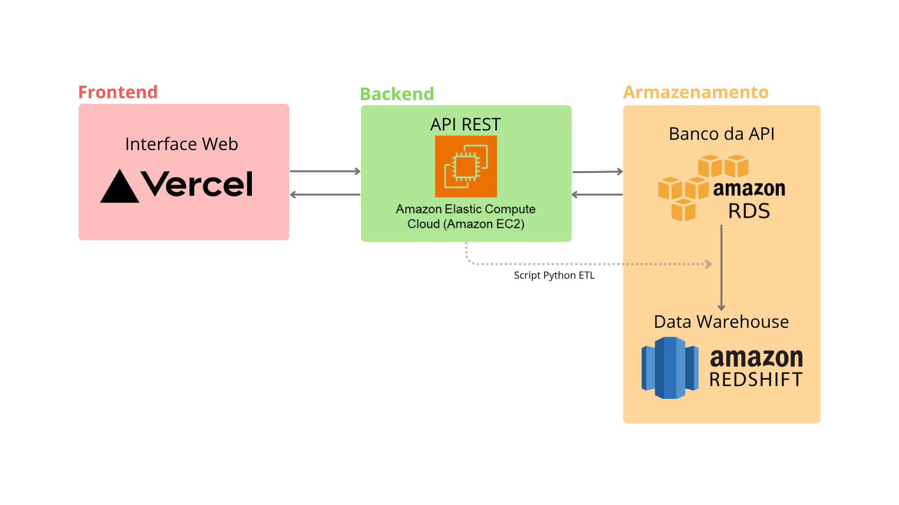

# API de Gerenciamento de Pedidos
### Equipe
- Enzo Daniel Abreu
- Gabriel da Silva Freitas
- José Carlos Pereira Neto
- Lucas Paulino Gomes
- Thierry Antonello Pengo

## 💭Contexto
Este projeto integrado foi desenvolvido durante o terceiro semestre do curso de
ciências da computação, intitulado "Desenvolvimento de Aplicação Web.
No projeto, fomos desafiados a utilizar a tecnologia para resolver problemas
de empresas reais, a fim de colocar em prática nossos conhecimentos teóricos em
ambientes e desafios presentes no dia a dia dos profissionais da área.

### Um pouco sobre a empresa...
A empresa escolhida pela equipe foi a Laticínios Trevo Casa Branca Ltda, também
conhecida como Argenzio, com sede em Casa Branca, São Paulo. Atuando na área de
produção de laticínios, ela atende empresas em toda a região, oferecendo ampla 
gama de produtos, incluindo leite UHT, queijos, manteigas, bebidas fermentadas,
entre outros.

#### O problema 💢
Os vendedores da empresa são responsáveis por registrar os pedidos feitos por 
outras empresas, mas isso é feito de uma forma ineficiente e muito manual: eles
saem de Casa Branca e viajam pelas cidades do estado de São Paulo, marcando os
pedidos no papel, e depois voltam para a sede e entregam os papéis para serem 
inseridos no sistema interno.

#### A proposta 💡
Para tornar o trabalho mais eficiente, utilizamos a proposta temática do módulo
para sugerir um sistema de gerenciamento web, no qual os vendedores poderiam
cadastrar os pedidos através de uma interface amigável e ergonômica, permitindo
à sede acessar e coletar em tempo real os pedidos. Além disso, o projeto conta
com uma arquitetura em nuvem, que visa reduzir os gastos com infraestrutura e
permitir maior escalabilidade e facilidade de manutenção. Abaixo, seguem os detalhes técnicos da implementação.

## 🏯Arquitetura

A arquitetura da nuvem segue o diagrama da imagem abaixo. Em suma, o sistema web completo compreende quatro grande componentes:
- A <span style="color: rgb(200,100,100);">interface web</span>, construída com HTML5, CSS3 e JavaScript e implementada no <span style="color: rgb(200,100,100);">Vercel</span>, uma PaaS (Plataforma como um Serviço) que nos permite criar e gerenciar websites sem que tenhamos o trabalho de configurar e manter a infraestrutura;
- Uma <span style="color: rgb(100,200,100);">API REST</span>, para a qual a interface faz as requisições, codificada utilizando NodeJS e Express e implantada numa máquina virtual <span style="color: rgb(100,200,100);">EC2</span>, na AWS. Apesar de ser mais trabalhoso utilizar a EC2, visto que é uma IaaS (Infraestrutura como um Serviço), ela nos dá um controle maior sobre as configurações e o sistema como um todo;
- Um <span style="color: rgb(200,200,100);">banco de dados relacional</span> para armazenar os dados que a API processa, para o qual o <span style="color: rgb(200,200,100);">Amazon RDS</span> provou ser a opção mais ergonômica. O RDS foi configurado com o MySQL e o único acesso permitido é o da API, que conta com medidas para autenticar os usuários via tokens JWT, evitando o uso indevido do sistema e o comprometimento dos dados.
- E, por fim, um <span style="color: rgb(230,150,100);">Data Warehouse</span> hospedado no <span style="color: rgb(230,150,100);">Amazon Redshift</span>, cujo propósito é permitir que os dados da API sejam integrados com outros dados externos, para dar aos analistas de dados uma visão mais ampla do negócio. Os dados serão carregados via ETL com a ajuda de um script Python localizado na EC2 da API. Esse script conta com a popular biblioteca Pandas para fazer o tratamento dos dados.



Para mais informações a respeito da interface web, leia o [README do seu repositório](https://github.com/aspiringluke/frontend-api).

## ⚙ A API

A API utiliza a arquitetura <code style="color:rgb(100,200,100);">REST</code> baseada no modelo <code style="color:rgb(100,200,100);">MVC</code>. Ou seja, ela é acessada através de métodos HTTP, e conta com Controllers para lidar com as requisições e respostas e Models para realizar as operações do banco de dados. O servidor e as rotas são gerenciados pelo <code style="color:rgb(100,200,100);">Express</code>, e o <code style="color:rgb(100,200,100);">SQL</code> é realizado com a ajuda do <code style="color:rgb(100,200,100);">Knex</code>. No que diz respeito aos usuários, as senhas são protegidas utilizando <code style="color:rgb(100,200,100);">bcryptjs</code> e <code style="color:rgb(100,200,100);">jsonwebtoken (JWT)</code>.

Para realizar a instalação, primeiro clone este repositório:
```sh
git clone https://github.com/aspiringluke/Projeto-Integrado-3.git
```

Logo em seguida instale as dependências listadas no <code style="color:rgb(100,200,100);">package.json</code>:
```sh
cd Projeto-Integrado-3
npm i[nstall]
```

> A API foi configurada para trabalhar com o MySQL. Caso queira utilizar um banco diferente, vá até a documentação do Knex e instale o pacote desejado. Lembre-se de remover o pacote do MySQL com <br> <code style="color:rgb(200,200,100);">npm unninstall mysql2</code>

Algumas informações críticas são colocadas num arquivo <code style="color:rgb(100,200,100);">.env</code>, para maior segurança. Portanto, você também deve criar o seu. Caso esteja em um terminal linux, pode editá-lo utilizando vim ou nano:
```sh
nano .env # recomendado, visto que o vim é menos intuitivo de usar
vim .env
```
> Máquinas Windows não vêm com editores de terminal por padrão, portanto deve-se utilizar o ambiente gráfico ou instalar os editores manualmente

Ao criar o arquivo, siga a seguinte estrutura:
```js
PORT = porta TCP da sua API (padrão: 4040)

DB_HOST = endereço do servidor de banco de dados
DB_USER = usuário do banco
DB_PASSWORD = senha do usuário
DB_DATABASE = qual banco/schema quer utilizar

SECRET = chave secreta utilizada para gerar os tokens JWT
```

A variável `PORT` é utilizada no arquivo `server.js`, as variáveis de conexão com o banco são mencionadas no arquivo `src/config/data.js` e o SECRET é chamado no `src/controllers/loginController.js` e nos arquivos de `src/middleware/`.

Pronto! A API está pronta para ser executada. Para fazer isso, basta executar o script npm ou executar o server diretamente:
```sh
npm start
# ou
node server.js
```

A documentação das rotas da API foi criada utilizando o Swagger. Para acessá-la, basta utilizar a rota <code style="color:rgb(100,200,100);">http://servidor-da-api:4040/api-docs</code>. Se precisar atualizar as rotas, caso tenha feito alguma alteração, basta utilizar o script npm:
```sh
npm run swagger-autogen
```
